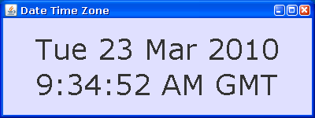

### Show Date Time (Java)

by: Keith Fenske, https://kwfenske.github.io/

ShowDateTime is a Java 1.4 graphical (GUI) application to display the current
date and/or time in a format and location of the user's choice. Options are
given on the command line, and can not be changed while the program is running.
The program runs until you close its window, press the Escape key, or click the
mouse on its display and choose Exit from the pop-up menu.

This project is somewhat unfinished. You will have to make your own changes
before the program is genuinely useful.

Download the ZIP file here: https://kwfenske.github.io/show-date-time-java.zip

Released under the terms and conditions of the Apache License (version 2.0 or
later) and/or the GNU General Public License (GPL, version 2 or later).

